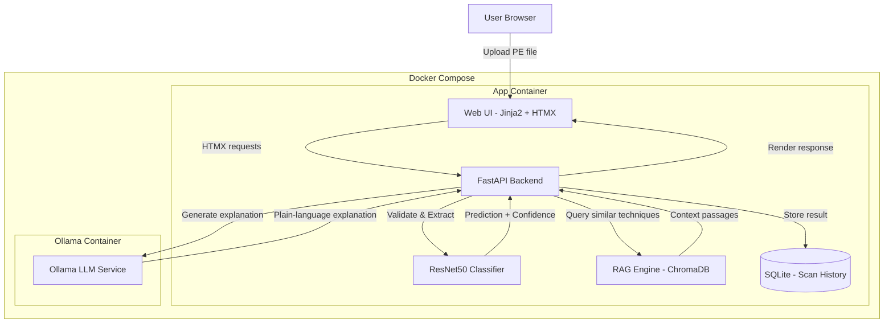
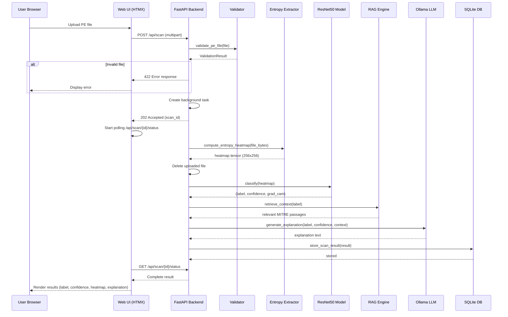

# Design Document: EntroSight

## Overview

EntroSight is a privacy-preserving Windows PE malware family classifier with explainable threat intelligence. The system accepts uploaded PE binaries (.exe, .dll, .sys), converts them to byte-entropy heatmaps, classifies them into malware families (or benign) using a ResNet50 model, and generates plain-language explanations of the classification using retrieval-augmented generation (RAG) backed by MITRE ATT&CK technique data.

The architecture is a five-stage pipeline: a Jinja2+HTMX web UI communicates with a FastAPI backend that orchestrates CPU-based PyTorch inference, ChromaDB retrieval, and Ollama-powered explanation generation. All processing happens locally—no data leaves the environment. Uploaded binaries are deleted immediately after feature extraction. The system is deployed via Docker Compose with two services (application container and Ollama container).

Target performance: classification under 1 second on CPU, full scan-to-explanation pipeline under 30 seconds. Supports 5–6 malware family classes (AgentTesla, Remcos, DCRat, etc.) plus a benign class.

## Architecture



## Sequence Diagrams

### Main Scan Flow



## Components and Interfaces

### Component 1: File Validator

**Purpose**: Validates uploaded files are legitimate PE binaries within acceptable parameters.

**Interface**:
```python
class FileValidator:
    ALLOWED_EXTENSIONS: set[str] = {".exe", ".dll", ".sys"}
    MAX_FILE_SIZE: int = 50 * 1024 * 1024  # 50 MB

    def validate(self, filename: str, file_bytes: bytes) -> ValidationResult:
        """Validate file extension, size, and MZ signature."""
        ...

@dataclass
class ValidationResult:
    is_valid: bool
    error_message: str | None = None
    file_hash: str | None = None  # SHA-256
```

**Responsibilities**:
- Check file extension against allowlist
- Enforce maximum file size limit
- Verify MZ signature (first 2 bytes == b"MZ")
- Compute SHA-256 hash for deduplication and storage

### Component 2: Entropy Heatmap Generator

**Purpose**: Converts raw PE bytes into a 256×256 byte-entropy heatmap image tensor suitable for ResNet50 input.

**Interface**:
```python
class EntropyHeatmapGenerator:
    BLOCK_SIZE: int = 256
    IMAGE_SIZE: tuple[int, int] = (256, 256)

    def generate(self, file_bytes: bytes) -> torch.Tensor:
        """Convert PE bytes to normalized entropy heatmap tensor.
        Returns: Tensor of shape (3, 256, 256) - RGB channels.
        """
        ...

    def generate_visualization(self, file_bytes: bytes) -> bytes:
        """Generate PNG visualization of the entropy heatmap.
        Returns: PNG image bytes for display.
        """
        ...
```

**Responsibilities**:
- Divide file bytes into fixed-size blocks
- Compute Shannon entropy for each block
- Map entropy values to a 2D grid (row-major fill)
- Normalize and resize to 256×256
- Convert to 3-channel tensor (replicate grayscale to RGB for ResNet50)
- Generate colormap visualization for UI display

### Component 3: ResNet50 Classifier

**Purpose**: Classifies byte-entropy heatmaps into malware family labels using a fine-tuned ResNet50 model.

**Interface**:
```python
class MalwareClassifier:
    CLASS_LABELS: list[str]  # ["AgentTesla", "Remcos", "DCRat", ..., "Benign"]

    def __init__(self, checkpoint_path: str, device: str = "cpu"):
        """Load model checkpoint and prepare for inference."""
        ...

    def classify(self, heatmap_tensor: torch.Tensor) -> ClassificationResult:
        """Run inference on a single heatmap tensor.
        Input: Tensor of shape (3, 256, 256)
        Returns: ClassificationResult with label, confidence, all probabilities.
        """
        ...

    def get_grad_cam(self, heatmap_tensor: torch.Tensor) -> torch.Tensor:
        """Generate Grad-CAM activation map for explainability.
        Returns: Tensor of shape (256, 256) with activation intensities.
        """
        ...

@dataclass
class ClassificationResult:
    predicted_label: str
    confidence: float  # 0.0 to 1.0
    all_probabilities: dict[str, float]
    inference_time_ms: float
```

**Responsibilities**:
- Load fine-tuned ResNet50 checkpoint from disk
- Apply ImageNet normalization transforms
- Run forward pass on CPU with torch.no_grad()
- Apply softmax to get probability distribution
- Generate Grad-CAM visualizations for interpretability
- Track inference time for performance monitoring

### Component 4: RAG Engine

**Purpose**: Retrieves relevant MITRE ATT&CK technique descriptions for the predicted malware family to provide context for explanation generation.

**Interface**:
```python
class RAGEngine:
    def __init__(self, collection_name: str = "mitre_attack"):
        """Initialize ChromaDB client and load/create collection."""
        ...

    def retrieve_context(
        self, family_label: str, top_k: int = 5
    ) -> list[RetrievedPassage]:
        """Query ChromaDB for relevant technique descriptions.
        Returns top-k most relevant passages for the family.
        """
        ...

    def ingest_knowledge_base(self, documents: list[Document]) -> int:
        """Ingest MITRE ATT&CK documents into ChromaDB.
        Returns number of documents ingested.
        """
        ...

@dataclass
class RetrievedPassage:
    text: str
    technique_id: str  # e.g., "T1055"
    technique_name: str
    relevance_score: float

@dataclass
class Document:
    text: str
    metadata: dict[str, str]  # technique_id, technique_name, family
```

**Responsibilities**:
- Manage ChromaDB persistent collection
- Embed and store MITRE ATT&CK technique descriptions
- Query by malware family label with semantic similarity
- Return ranked passages with metadata for LLM context

### Component 5: Explanation Generator

**Purpose**: Uses Ollama LLM to produce plain-language threat intelligence explanations from classification results and RAG context.

**Interface**:
```python
class ExplanationGenerator:
    def __init__(self, ollama_base_url: str, model_name: str = "mistral"):
        """Initialize Ollama client connection."""
        ...

    async def generate(
        self,
        label: str,
        confidence: float,
        context_passages: list[RetrievedPassage],
    ) -> ExplanationResult:
        """Generate plain-language explanation of classification.
        Returns structured explanation with timing info.
        """
        ...

@dataclass
class ExplanationResult:
    explanation_text: str
    generation_time_ms: float
    model_used: str
```

**Responsibilities**:
- Format prompt with classification result and RAG context
- Call Ollama API for text generation
- Structure response as threat intelligence narrative
- Handle timeout/retry for LLM calls
- Track generation time for performance monitoring

### Component 6: Scan History Database

**Purpose**: Persists scan results for historical review and deduplication.

**Interface**:
```python
class ScanHistoryDB:
    def __init__(self, db_path: str = "data/scans.db"):
        """Initialize SQLite connection and ensure schema exists."""
        ...

    async def store_result(self, result: ScanRecord) -> int:
        """Store a completed scan result. Returns record ID."""
        ...

    async def get_result(self, scan_id: int) -> ScanRecord | None:
        """Retrieve a scan result by ID."""
        ...

    async def get_by_hash(self, sha256: str) -> ScanRecord | None:
        """Check if file was previously scanned (deduplication)."""
        ...

    async def list_recent(self, limit: int = 20) -> list[ScanRecord]:
        """List most recent scan results for history view."""
        ...

@dataclass
class ScanRecord:
    id: int | None
    sha256: str
    filename: str
    predicted_label: str
    confidence: float
    explanation: str
    heatmap_path: str  # Path to saved heatmap PNG
    timestamp: datetime
    total_time_ms: float
```

**Responsibilities**:
- Manage SQLite database lifecycle
- Create schema on first run
- Store and retrieve scan results
- Support hash-based deduplication lookup
- Provide paginated history listing

## Data Models

### Model 1: ScanRequest

```python
from pydantic import BaseModel
from fastapi import UploadFile

class ScanRequest(BaseModel):
    """Incoming scan request from the web UI."""
    file: UploadFile

    class Config:
        arbitrary_types_allowed = True
```

**Validation Rules**:
- File must have extension in {.exe, .dll, .sys}
- File size must be ≤ 50 MB
- File content must start with MZ signature (0x4D5A)

### Model 2: ScanResponse

```python
from pydantic import BaseModel
from datetime import datetime

class ScanResponse(BaseModel):
    """Complete scan result returned to the UI."""
    scan_id: int
    sha256: str
    filename: str
    predicted_label: str
    confidence: float
    explanation: str
    heatmap_url: str
    timestamp: datetime
    total_time_ms: float

class ScanStatusResponse(BaseModel):
    """Polling response for async scan status."""
    scan_id: str
    status: str  # "pending", "processing", "complete", "error"
    progress_stage: str | None = None  # "validating", "classifying", "explaining"
    result: ScanResponse | None = None
    error_message: str | None = None
```

### Model 3: Database Schema

```sql
CREATE TABLE IF NOT EXISTS scan_results (
    id INTEGER PRIMARY KEY AUTOINCREMENT,
    sha256 TEXT NOT NULL,
    filename TEXT NOT NULL,
    predicted_label TEXT NOT NULL,
    confidence REAL NOT NULL,
    explanation TEXT NOT NULL,
    heatmap_path TEXT NOT NULL,
    timestamp DATETIME DEFAULT CURRENT_TIMESTAMP,
    total_time_ms REAL NOT NULL
);

CREATE INDEX IF NOT EXISTS idx_scan_results_sha256 ON scan_results(sha256);
CREATE INDEX IF NOT EXISTS idx_scan_results_timestamp ON scan_results(timestamp DESC);
```

### Model 4: Application Configuration

```python
from pydantic_settings import BaseSettings

class AppSettings(BaseSettings):
    """Application configuration loaded from environment."""
    # Model settings
    model_checkpoint_path: str = "models/resnet50_malware.pth"
    class_labels: list[str] = [
        "AgentTesla", "Remcos", "DCRat", "AsyncRAT",
        "RedLineStealer", "Formbook", "Benign"
    ]

    # Processing settings
    max_file_size_mb: int = 50
    entropy_block_size: int = 256
    heatmap_image_size: int = 256

    # RAG settings
    chromadb_path: str = "data/chromadb"
    rag_collection_name: str = "mitre_attack"
    rag_top_k: int = 5

    # Ollama settings
    ollama_base_url: str = "http://ollama:11434"
    ollama_model: str = "mistral"
    explanation_max_tokens: int = 512
    ollama_timeout_seconds: int = 60

    # Database settings
    database_path: str = "data/scans.db"

    # Storage settings
    heatmap_storage_dir: str = "data/heatmaps"

    class Config:
        env_prefix = "ENTROSIGHT_"
```

## Algorithmic Pseudocode

### Algorithm 1: Byte-Entropy Heatmap Generation

```python
def compute_entropy_heatmap(file_bytes: bytes, block_size: int = 256) -> torch.Tensor:
    """
    Convert raw PE file bytes into a 256x256 entropy heatmap tensor.

    Algorithm:
    1. Divide file into fixed-size blocks
    2. Compute Shannon entropy for each block
    3. Arrange entropy values into a 2D grid
    4. Resize to 256x256 and normalize
    5. Replicate to 3 channels for ResNet50 input
    """
    import math
    from collections import Counter

    # Step 1: Divide into blocks
    num_blocks = math.ceil(len(file_bytes) / block_size)
    entropy_values = []

    # Step 2: Compute Shannon entropy per block
    for i in range(num_blocks):
        block = file_bytes[i * block_size : (i + 1) * block_size]
        if len(block) == 0:
            entropy_values.append(0.0)
            continue

        # Shannon entropy: H = -Σ p(x) * log2(p(x))
        byte_counts = Counter(block)
        block_len = len(block)
        entropy = 0.0
        for count in byte_counts.values():
            p = count / block_len
            if p > 0:
                entropy -= p * math.log2(p)

        # Normalize to [0, 1] range (max entropy for bytes = 8.0)
        entropy_values.append(entropy / 8.0)

    # Step 3: Arrange into 2D grid (square, row-major)
    grid_side = math.ceil(math.sqrt(num_blocks))
    # Pad with zeros if needed
    while len(entropy_values) < grid_side * grid_side:
        entropy_values.append(0.0)

    grid = torch.tensor(entropy_values[:grid_side * grid_side]).reshape(grid_side, grid_side)

    # Step 4: Resize to 256x256
    grid_resized = F.interpolate(
        grid.unsqueeze(0).unsqueeze(0), size=(256, 256), mode="bilinear"
    ).squeeze()

    # Step 5: Replicate to 3 channels (RGB) for ResNet50
    heatmap_tensor = grid_resized.unsqueeze(0).repeat(3, 1, 1)

    return heatmap_tensor
```

**Preconditions:**
- `file_bytes` is non-empty and represents a valid PE file
- `block_size` is a positive integer

**Postconditions:**
- Returns tensor of shape (3, 256, 256)
- All values in range [0.0, 1.0]
- Entropy distribution faithfully represents byte randomness structure

**Loop Invariants:**
- After processing block i: `len(entropy_values) == i + 1`
- Each entropy value is in range [0.0, 1.0]

### Algorithm 2: Classification Pipeline

```python
@torch.no_grad()
def classify(self, heatmap_tensor: torch.Tensor) -> ClassificationResult:
    """
    Run ResNet50 inference on entropy heatmap.

    Algorithm:
    1. Apply ImageNet normalization
    2. Add batch dimension
    3. Forward pass through model
    4. Apply softmax for probabilities
    5. Extract top prediction
    """
    import time

    start_time = time.perf_counter()

    # Step 1: Normalize with ImageNet stats
    normalize = transforms.Normalize(
        mean=[0.485, 0.456, 0.406],
        std=[0.229, 0.224, 0.225]
    )
    normalized = normalize(heatmap_tensor)

    # Step 2: Add batch dimension
    input_tensor = normalized.unsqueeze(0)  # Shape: (1, 3, 256, 256)

    # Step 3: Forward pass
    logits = self.model(input_tensor)  # Shape: (1, num_classes)

    # Step 4: Softmax probabilities
    probabilities = torch.softmax(logits, dim=1).squeeze()

    # Step 5: Extract prediction
    top_idx = torch.argmax(probabilities).item()
    confidence = probabilities[top_idx].item()
    predicted_label = self.class_labels[top_idx]

    elapsed_ms = (time.perf_counter() - start_time) * 1000

    return ClassificationResult(
        predicted_label=predicted_label,
        confidence=confidence,
        all_probabilities={
            label: prob.item()
            for label, prob in zip(self.class_labels, probabilities)
        },
        inference_time_ms=elapsed_ms,
    )
```

**Preconditions:**
- `heatmap_tensor` has shape (3, 256, 256) with values in [0.0, 1.0]
- Model is loaded and in eval mode
- `self.class_labels` matches model output dimension

**Postconditions:**
- `predicted_label` is one of `self.class_labels`
- `confidence` is in range (0.0, 1.0]
- `sum(all_probabilities.values())` ≈ 1.0
- `inference_time_ms` > 0

**Loop Invariants:** N/A (no explicit loops)

### Algorithm 3: RAG Context Retrieval

```python
def retrieve_context(
    self, family_label: str, top_k: int = 5
) -> list[RetrievedPassage]:
    """
    Query ChromaDB for MITRE ATT&CK techniques relevant to the family.

    Algorithm:
    1. Format query string with family name
    2. Query ChromaDB with semantic search
    3. Filter results by relevance threshold
    4. Map to RetrievedPassage objects
    """
    # Step 1: Format query
    query_text = f"Malware family {family_label} techniques and behaviors"

    # Step 2: Query ChromaDB
    results = self.collection.query(
        query_texts=[query_text],
        n_results=top_k,
        where={"family": {"$in": [family_label, "general"]}},
    )

    # Step 3 & 4: Filter and map results
    passages = []
    for i, (doc, metadata, distance) in enumerate(
        zip(results["documents"][0], results["metadatas"][0], results["distances"][0])
    ):
        relevance_score = 1.0 - distance  # ChromaDB distance to similarity
        if relevance_score < 0.3:  # Minimum relevance threshold
            continue
        passages.append(
            RetrievedPassage(
                text=doc,
                technique_id=metadata.get("technique_id", "unknown"),
                technique_name=metadata.get("technique_name", "unknown"),
                relevance_score=relevance_score,
            )
        )

    return passages
```

**Preconditions:**
- `family_label` is a valid label from the classifier's label set
- ChromaDB collection is initialized and populated
- `top_k` is a positive integer

**Postconditions:**
- Returns list of 0 to `top_k` passages
- Each passage has relevance_score ≥ 0.3
- Passages are ordered by relevance (highest first)
- All passages are related to the queried family or general techniques

**Loop Invariants:**
- After processing result i: `len(passages) <= i + 1`
- All passages in list have relevance_score ≥ 0.3

### Algorithm 4: Explanation Generation

```python
async def generate(
    self,
    label: str,
    confidence: float,
    context_passages: list[RetrievedPassage],
) -> ExplanationResult:
    """
    Generate plain-language threat intelligence explanation via Ollama.

    Algorithm:
    1. Format system prompt with role context
    2. Build user prompt with classification + RAG context
    3. Call Ollama API
    4. Parse and return structured result
    """
    import time
    import httpx

    start_time = time.perf_counter()

    # Step 1: System prompt
    system_prompt = (
        "You are a malware analyst providing clear, concise threat intelligence "
        "explanations. Explain what the detected malware family does, its typical "
        "behaviors, and potential impact. Use plain language suitable for a "
        "security analyst. Keep response under 200 words."
    )

    # Step 2: Build context from RAG passages
    context_text = "\n\n".join(
        f"[{p.technique_id}] {p.technique_name}: {p.text}"
        for p in context_passages
    )

    user_prompt = (
        f"Classification Result:\n"
        f"- Family: {label}\n"
        f"- Confidence: {confidence:.1%}\n\n"
        f"Relevant MITRE ATT&CK Techniques:\n{context_text}\n\n"
        f"Provide a plain-language explanation of this malware family, "
        f"its typical behaviors, and recommended actions."
    )

    # Step 3: Call Ollama
    async with httpx.AsyncClient(timeout=self.timeout) as client:
        response = await client.post(
            f"{self.ollama_base_url}/api/generate",
            json={
                "model": self.model_name,
                "system": system_prompt,
                "prompt": user_prompt,
                "stream": False,
                "options": {"num_predict": self.max_tokens},
            },
        )
        response.raise_for_status()
        result_data = response.json()

    elapsed_ms = (time.perf_counter() - start_time) * 1000

    # Step 4: Return structured result
    return ExplanationResult(
        explanation_text=result_data["response"].strip(),
        generation_time_ms=elapsed_ms,
        model_used=self.model_name,
    )
```

**Preconditions:**
- `label` is a valid malware family label
- `confidence` is in range (0.0, 1.0]
- `context_passages` contains 0 or more relevant passages
- Ollama service is accessible at `self.ollama_base_url`

**Postconditions:**
- `explanation_text` is non-empty string
- `generation_time_ms` > 0
- `model_used` matches configured model name
- Response is under ~200 words (soft limit, LLM-enforced)

**Loop Invariants:** N/A

### Algorithm 5: Full Scan Orchestration (Background Task)

```python
async def execute_scan(
    scan_id: str,
    file_bytes: bytes,
    filename: str,
    settings: AppSettings,
    components: AppComponents,
) -> ScanRecord:
    """
    Orchestrate the complete scan pipeline as a background task.

    Algorithm:
    1. Validate PE file
    2. Generate entropy heatmap
    3. Delete raw file bytes from memory
    4. Classify heatmap
    5. Retrieve RAG context
    6. Generate explanation
    7. Save heatmap visualization
    8. Store result in database
    """
    import time

    start_time = time.perf_counter()

    # Step 1: Validate
    update_scan_status(scan_id, "processing", "validating")
    validation = components.validator.validate(filename, file_bytes)
    if not validation.is_valid:
        update_scan_status(scan_id, "error", error=validation.error_message)
        raise ValueError(validation.error_message)

    # Step 2: Generate heatmap
    update_scan_status(scan_id, "processing", "classifying")
    heatmap_tensor = components.heatmap_generator.generate(file_bytes)
    heatmap_viz_bytes = components.heatmap_generator.generate_visualization(file_bytes)

    # Step 3: Delete raw file bytes (privacy-preserving)
    del file_bytes

    # Step 4: Classify
    classification = components.classifier.classify(heatmap_tensor)

    # Step 5: Retrieve context
    update_scan_status(scan_id, "processing", "explaining")
    passages = components.rag_engine.retrieve_context(
        classification.predicted_label, top_k=settings.rag_top_k
    )

    # Step 6: Generate explanation
    explanation = await components.explanation_generator.generate(
        label=classification.predicted_label,
        confidence=classification.confidence,
        context_passages=passages,
    )

    # Step 7: Save heatmap visualization
    heatmap_path = save_heatmap_png(
        heatmap_viz_bytes, validation.file_hash, settings.heatmap_storage_dir
    )

    # Step 8: Store in database
    total_time_ms = (time.perf_counter() - start_time) * 1000
    record = ScanRecord(
        id=None,
        sha256=validation.file_hash,
        filename=filename,
        predicted_label=classification.predicted_label,
        confidence=classification.confidence,
        explanation=explanation.explanation_text,
        heatmap_path=heatmap_path,
        timestamp=datetime.utcnow(),
        total_time_ms=total_time_ms,
    )
    record.id = await components.db.store_result(record)

    update_scan_status(scan_id, "complete", result=record)
    return record
```

**Preconditions:**
- `file_bytes` is non-empty
- All components are initialized and ready
- Scan ID is unique and registered in status tracker

**Postconditions:**
- Raw file bytes are deleted from memory
- Scan result is persisted in database
- Heatmap visualization is saved to disk
- Scan status is updated to "complete" or "error"
- `total_time_ms` reflects end-to-end pipeline time

**Loop Invariants:** N/A (sequential pipeline)

## Key Functions with Formal Specifications

### Function: validate_pe_file()

```python
def validate(self, filename: str, file_bytes: bytes) -> ValidationResult:
    """Validate an uploaded file as a legitimate PE binary."""
    import hashlib
    from pathlib import Path

    # Check extension
    ext = Path(filename).suffix.lower()
    if ext not in self.ALLOWED_EXTENSIONS:
        return ValidationResult(
            is_valid=False,
            error_message=f"Invalid file type '{ext}'. Allowed: {self.ALLOWED_EXTENSIONS}"
        )

    # Check size
    if len(file_bytes) > self.MAX_FILE_SIZE:
        max_mb = self.MAX_FILE_SIZE // (1024 * 1024)
        return ValidationResult(
            is_valid=False,
            error_message=f"File too large. Maximum size: {max_mb} MB"
        )

    # Check MZ signature
    if len(file_bytes) < 2 or file_bytes[:2] != b"MZ":
        return ValidationResult(
            is_valid=False,
            error_message="Invalid PE file: missing MZ signature"
        )

    # Compute hash
    sha256 = hashlib.sha256(file_bytes).hexdigest()

    return ValidationResult(is_valid=True, file_hash=sha256)
```

**Preconditions:**
- `filename` is a non-empty string
- `file_bytes` is a bytes object (may be empty)

**Postconditions:**
- If `is_valid` is True: file has valid extension, size ≤ MAX_FILE_SIZE, starts with MZ, and `file_hash` is a 64-char hex string
- If `is_valid` is False: `error_message` explains the failure reason
- Function has no side effects

### Function: load_model_checkpoint()

```python
def __init__(self, checkpoint_path: str, device: str = "cpu"):
    """Load fine-tuned ResNet50 from checkpoint."""
    from torchvision.models import resnet50

    self.device = torch.device(device)

    # Initialize ResNet50 architecture with modified final layer
    self.model = resnet50(weights=None)
    num_classes = len(self.CLASS_LABELS)
    self.model.fc = torch.nn.Linear(self.model.fc.in_features, num_classes)

    # Load trained weights
    checkpoint = torch.load(checkpoint_path, map_location=self.device)
    self.model.load_state_dict(checkpoint["model_state_dict"])

    # Set to evaluation mode
    self.model.eval()
    self.model.to(self.device)
```

**Preconditions:**
- `checkpoint_path` exists and contains valid PyTorch checkpoint
- Checkpoint contains key "model_state_dict"
- Checkpoint model was trained with same number of classes as CLASS_LABELS

**Postconditions:**
- `self.model` is in eval mode on specified device
- Model final layer output dimension matches `len(CLASS_LABELS)`
- No gradients will be computed during inference

## Example Usage

```python
# Example 1: Complete scan workflow (API endpoint)
from fastapi import FastAPI, UploadFile, BackgroundTasks
from uuid import uuid4

app = FastAPI()

@app.post("/api/scan", status_code=202)
async def submit_scan(
    file: UploadFile,
    background_tasks: BackgroundTasks,
):
    file_bytes = await file.read()
    scan_id = str(uuid4())

    # Register scan in status tracker
    scan_status_store[scan_id] = {"status": "pending"}

    # Launch background processing
    background_tasks.add_task(
        execute_scan,
        scan_id=scan_id,
        file_bytes=file_bytes,
        filename=file.filename,
        settings=app.state.settings,
        components=app.state.components,
    )

    return {"scan_id": scan_id, "status": "pending"}


# Example 2: Polling for results (HTMX)
@app.get("/api/scan/{scan_id}/status")
async def get_scan_status(scan_id: str):
    status = scan_status_store.get(scan_id)
    if status is None:
        raise HTTPException(404, "Scan not found")
    return ScanStatusResponse(**status)


# Example 3: Scan history page
@app.get("/history")
async def history_page(request: Request):
    recent_scans = await app.state.components.db.list_recent(limit=20)
    return templates.TemplateResponse(
        "history.html", {"request": request, "scans": recent_scans}
    )


# Example 4: HTMX frontend interaction
"""
<!-- Upload form with HTMX -->
<form hx-post="/api/scan"
      hx-encoding="multipart/form-data"
      hx-target="#result-container"
      hx-indicator="#loading-spinner">
    <input type="file" name="file" accept=".exe,.dll,.sys" required>
    <button type="submit">Analyze</button>
</form>

<!-- Result polling (triggered after upload response) -->
<div id="result-container"
     hx-get="/api/scan/{scan_id}/status"
     hx-trigger="every 2s"
     hx-swap="innerHTML">
</div>
"""
```

## Correctness Properties

The following properties must hold for any valid execution of the system:

### Property 1: File Privacy

For all scans, the raw uploaded file bytes are deleted from memory and disk before the scan status transitions to "complete". No raw file content is persisted beyond the heatmap representation.

### Property 2: Validation Completeness

For all uploaded files, exactly one of the following holds: (a) the file passes all validation checks and proceeds to classification, or (b) the file fails validation and an error is returned without any further processing.

### Property 3: Classification Determinism

For all identical file inputs, `classify(generate_heatmap(file_bytes))` produces identical `(predicted_label, confidence)` pairs (given the same model checkpoint).

### Property 4: Probability Normalization

For all classification results, the sum of `all_probabilities` values equals 1.0 (within floating-point tolerance of ±1e-6).

### Property 5: Entropy Bounds

For all byte blocks, the computed Shannon entropy is in the range [0.0, 8.0], and the normalized value is in [0.0, 1.0].

### Property 6: Hash Integrity

For all stored scan results, the `sha256` field equals `hashlib.sha256(original_file_bytes).hexdigest()` computed at validation time.

### Property 7: Scan Completeness

For all scans that reach "complete" status, the database contains a record with non-null values for: sha256, predicted_label, confidence, explanation, heatmap_path, and timestamp.

### Property 8: Performance Bound

For all scans on files ≤ 50MB, `classification.inference_time_ms < 1000` (1 second target on CPU). The full pipeline `total_time_ms < 30000` (30 second target).

### Property 9: Deduplication Consistency

For all files with the same SHA-256 hash, repeated scans produce the same `predicted_label` (model determinism).

### Property 10: Extension-Signature Alignment

For all files that pass validation, the file has both a valid extension (.exe, .dll, .sys) AND a valid MZ signature. Neither check alone is sufficient.

## Error Handling

### Error Scenario 1: Invalid File Upload

**Condition**: File fails validation (wrong extension, too large, missing MZ signature)
**Response**: Return 422 Unprocessable Entity with specific error message
**Recovery**: User is prompted to upload a different file; no state is mutated

### Error Scenario 2: Model Checkpoint Not Found

**Condition**: ResNet50 checkpoint file missing or corrupted at startup
**Response**: Application fails to start with clear error message in logs
**Recovery**: Operator must provide valid checkpoint at configured path; Docker healthcheck fails

### Error Scenario 3: Ollama Service Unavailable

**Condition**: Ollama container is down or unresponsive during explanation generation
**Response**: Scan completes with classification result but explanation field contains fallback message: "Explanation unavailable - LLM service temporarily unreachable"
**Recovery**: Scan result is stored; user can retry explanation generation later; system monitors Ollama health

### Error Scenario 4: ChromaDB Query Failure

**Condition**: ChromaDB collection is empty or query fails
**Response**: Explanation is generated without RAG context (LLM uses only classification result)
**Recovery**: Graceful degradation; explanation quality reduced but system remains functional

### Error Scenario 5: File Read/Memory Error

**Condition**: Large file causes memory pressure during entropy computation
**Response**: Background task catches MemoryError, marks scan as "error"
**Recovery**: Scan status updated with error message; uploaded file cleaned up; system remains operational for smaller files

### Error Scenario 6: Database Write Failure

**Condition**: SQLite database is locked or disk full
**Response**: Scan result is returned to user but not persisted; warning logged
**Recovery**: Result available in current session; retry persistence on next request; alert operator

## Testing Strategy

### Unit Testing Approach

- **File Validator**: Test all validation rules with valid PE headers, invalid extensions, oversized files, empty files, files with wrong magic bytes
- **Entropy Heatmap**: Verify output tensor shape (3, 256, 256), value range [0, 1], known entropy for uniform/random byte sequences
- **Classifier**: Mock model to verify correct tensor preprocessing, softmax application, label mapping
- **RAG Engine**: Mock ChromaDB to verify query formatting, relevance filtering, passage mapping
- **Database**: Test CRUD operations with in-memory SQLite

### Property-Based Testing Approach

**Property Test Library**: Hypothesis (Python)

Key properties to test with Hypothesis:
- For any byte sequence of length 1 to MAX_FILE_SIZE, entropy computation produces values in [0.0, 1.0]
- For any valid PE file (generated with MZ header + random content), validation always succeeds
- For any tensor of shape (3, 256, 256), classifier produces probabilities summing to ~1.0
- For any filename with allowed extensions + MZ bytes, validation returns is_valid=True with non-None hash
- Heatmap generation is deterministic: same input bytes always produce same output tensor

### Integration Testing Approach

- **End-to-end pipeline**: Upload a known benign PE file, verify complete flow from upload to stored result
- **Docker Compose**: Health check all services, verify inter-container networking
- **Ollama integration**: Verify explanation generation with real model (integration test only)
- **Performance regression**: Time full pipeline, assert within performance targets

## Performance Considerations

- **Model Loading**: Load ResNet50 checkpoint once at startup, reuse for all requests
- **CPU Inference**: Use `torch.no_grad()` context and eval mode to minimize memory and compute
- **Async Processing**: Background tasks prevent request blocking; HTMX polling for results
- **Entropy Computation**: Vectorize byte counting with numpy for large files
- **Heatmap Caching**: Consider caching heatmaps by SHA-256 to skip recomputation for duplicate files
- **Connection Pooling**: Reuse httpx client for Ollama calls; persistent ChromaDB client
- **Memory Management**: Explicitly delete file bytes after heatmap generation to free memory

## Security Considerations

- **No Authentication**: Single-user demo scope; not suitable for multi-user deployment
- **File Deletion**: Raw PE binaries deleted immediately after entropy extraction (never persisted)
- **No Execution**: Uploaded binaries are never executed, only read as byte arrays
- **Input Validation**: Strict file type, size, and signature checks before processing
- **Local Processing**: All inference and LLM calls happen locally; no external API calls
- **Docker Isolation**: Application runs in containers with limited host access
- **No Sensitive Logging**: File contents and binary data never written to logs

## Dependencies

| Package | Purpose | Version |
|---------|---------|---------|
| fastapi | Web framework and API | >=0.104.0 |
| uvicorn | ASGI server | >=0.24.0 |
| jinja2 | HTML templating | >=3.1.0 |
| python-multipart | File upload handling | >=0.0.6 |
| torch | PyTorch for model inference | >=2.1.0 |
| torchvision | ResNet50 architecture and transforms | >=0.16.0 |
| chromadb | Vector database for RAG | >=0.4.0 |
| httpx | Async HTTP client for Ollama | >=0.25.0 |
| pydantic | Data validation and settings | >=2.5.0 |
| pydantic-settings | Environment configuration | >=2.1.0 |
| aiosqlite | Async SQLite access | >=0.19.0 |
| pillow | Image generation for heatmap visualization | >=10.0.0 |
| matplotlib | Colormap application for heatmap PNGs | >=3.8.0 |
| numpy | Numerical operations for entropy | >=1.24.0 |
| hypothesis | Property-based testing | >=6.92.0 |
| pytest | Test framework | >=7.4.0 |
| pytest-asyncio | Async test support | >=0.23.0 |

### External Services (Docker Compose)

| Service | Image | Purpose |
|---------|-------|---------|
| ollama | ollama/ollama:latest | Local LLM for explanation generation |

### Project Structure

```
entrosight/
├── app/
│   ├── __init__.py
│   ├── main.py              # FastAPI app, lifespan, routes
│   ├── config.py            # AppSettings
│   ├── models.py            # Pydantic models (request/response)
│   ├── components/
│   │   ├── __init__.py
│   │   ├── validator.py     # FileValidator
│   │   ├── heatmap.py       # EntropyHeatmapGenerator
│   │   ├── classifier.py    # MalwareClassifier
│   │   ├── rag.py           # RAGEngine
│   │   ├── explainer.py     # ExplanationGenerator
│   │   └── database.py      # ScanHistoryDB
│   ├── scan.py              # Scan orchestration (background task)
│   ├── templates/
│   │   ├── base.html
│   │   ├── index.html       # Upload page
│   │   ├── result.html      # Scan result display
│   │   ├── history.html     # Scan history table
│   │   └── partials/
│   │       ├── scan_status.html
│   │       └── result_card.html
│   └── static/
│       └── css/
├── data/
│   ├── chromadb/            # ChromaDB persistent storage
│   ├── heatmaps/            # Generated heatmap PNGs
│   ├── scans.db             # SQLite database
│   └── knowledge_base/     # MITRE ATT&CK source documents
├── models/
│   └── resnet50_malware.pth # Trained model checkpoint
├── tests/
│   ├── test_validator.py
│   ├── test_heatmap.py
│   ├── test_classifier.py
│   ├── test_rag.py
│   ├── test_explainer.py
│   ├── test_scan.py
│   └── conftest.py
├── docker-compose.yml
├── Dockerfile
├── requirements.txt
└── README.md
```
