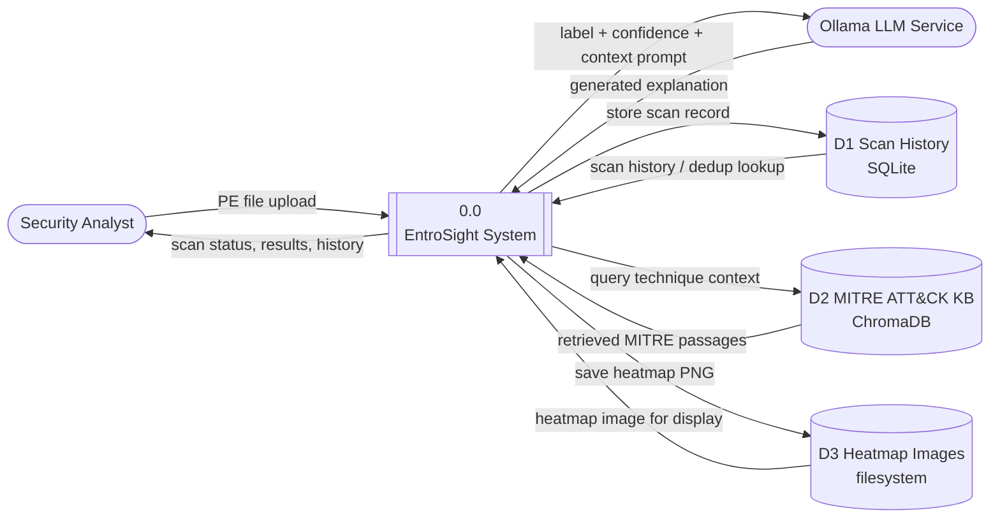

# EntroSight

A privacy-preserving Windows PE malware family classifier with explainable threat intelligence.

## What It Does

EntroSight accepts uploaded PE binaries (.exe, .dll, .sys), converts them to byte-entropy heatmaps, classifies them into malware families using a fine-tuned ResNet50 model, and generates plain-language threat explanations backed by MITRE ATT&CK intelligence.

**Supported families:** AgentTesla, Remcos, DCRat, AsyncRAT, RedLineStealer, Formbook, and Benign.

## Key Principles

- **Privacy-preserving** — uploaded binaries are deleted from memory immediately after feature extraction. No data leaves your environment.
- **Explainable AI** — classifications come with MITRE ATT&CK-grounded explanations, not just labels.
- **Fully local** — all inference, retrieval, and LLM generation run on-premises via Docker Compose.

## Architecture

```
User Browser → Web UI (Jinja2 + HTMX) → FastAPI Backend
    → File Validator → Entropy Heatmap Generator → ResNet50 Classifier
    → RAG Engine (ChromaDB + MITRE ATT&CK) → Ollama LLM → Explanation
    → SQLite (scan history)
```

Two Docker containers:
- `app` — Python application (port 8000)
- `ollama` — Ollama LLM service (port 11434)

## Data Flow Diagram (Level 0)



The system boundary (`0.0 EntroSight System`) covers the FastAPI app and its in-process pipeline (validation, heatmap generation, classification, RAG retrieval). Ollama is treated as an external service since it runs in its own container. GitHub renders this diagram automatically; for other viewers, use a [Mermaid live editor](https://mermaid.live) or a Markdown preview with Mermaid support.

## Pipeline Components

| Component | File | What It Does |
|-----------|------|---------------|
| **FileValidator** | `app/components/validator.py` | Validates uploads against the `.exe`/`.dll`/`.sys` allowlist, enforces the 50 MB size limit, checks the MZ (PE) signature, and computes a SHA-256 hash for deduplication. |
| **EntropyHeatmapGenerator** | `app/components/heatmap.py` | Splits the file into 256-byte blocks, computes Shannon entropy per block, arranges the values into a square grid, resizes it to 256×256 via bilinear interpolation, and replicates it into a 3-channel tensor. Also renders an "inferno" colormap PNG for display. |
| **MalwareClassifier** | `app/components/classifier.py` | Runs the heatmap tensor through a fine-tuned ResNet50 (CPU inference) to produce a predicted family label, confidence score, and full probability distribution. Also supports Grad-CAM activation maps for explainability. |
| **RAGEngine** | `app/components/rag.py` | Queries a persistent ChromaDB collection for MITRE ATT&CK passages relevant to the predicted family, filtering results below a 0.3 relevance threshold. Also handles one-time ingestion of the knowledge base. |
| **ExplanationGenerator** | `app/components/explainer.py` | Builds a prompt from the classification result and retrieved MITRE passages, sends it to the Ollama `/api/generate` endpoint, and returns a plain-language explanation. Falls back to a static message if Ollama is unreachable or times out. |
| **ScanHistoryDB** | `app/components/database.py` | Async SQLite (aiosqlite) wrapper that persists scan records (hash, label, confidence, explanation, heatmap path, timestamp) and supports lookups by ID, by hash (dedup), and recent-history listing. |
| **scan.py (orchestrator)** | `app/scan.py` | Coordinates the full pipeline as a FastAPI background task: validate → generate heatmap → discard raw bytes → classify → retrieve RAG context → generate explanation → save heatmap PNG → persist to DB. Tracks per-scan status in memory for HTMX polling. |
| **main.py (FastAPI app)** | `app/main.py` | Wires up all components in the lifespan handler, exposes `POST /api/scan` and `GET /api/scan/{id}/status` (JSON or HTMX fragments), and serves the upload, history, and result pages. |

## Requirements

- Python 3.11+
- Docker & Docker Compose (for deployment)
- A trained ResNet50 checkpoint file (`.pth`) placed in `models/`

## Quick Start (Development)

```bash
# Install dependencies
pip install -r requirements.txt

# Run the dev server
python -m uvicorn app.main:app --reload --host 127.0.0.1 --port 8000

# Run tests
pytest tests/ -v
```

## Quick Start (Docker)

```bash
# Build and run both containers
docker-compose up --build

# The app will be available at http://localhost:8000
# Ollama pulls the Mistral model on first startup
```

## Environment Variables

All settings use the `ENTROSIGHT_` prefix:

| Variable | Default | Description |
|----------|---------|-------------|
| `ENTROSIGHT_MODEL_CHECKPOINT_PATH` | `models/resnet50_malware.pth` | Path to the trained model |
| `ENTROSIGHT_OLLAMA_BASE_URL` | `http://ollama:11434` | Ollama service URL |
| `ENTROSIGHT_OLLAMA_MODEL` | `mistral` | LLM model for explanations |
| `ENTROSIGHT_DATABASE_PATH` | `data/scans.db` | SQLite database path |
| `ENTROSIGHT_CHROMADB_PATH` | `data/chromadb` | ChromaDB storage path |
| `ENTROSIGHT_MAX_FILE_SIZE_MB` | `50` | Max upload size in MB |

## Project Structure

```
entrovision/
├── app/
│   ├── main.py                 # FastAPI app, routes, lifespan
│   ├── config.py               # AppSettings (pydantic-settings)
│   ├── models.py               # Pydantic/dataclass models
│   ├── scan.py                 # Scan orchestration pipeline
│   ├── knowledge_base_loader.py
│   ├── components/
│   │   ├── validator.py        # PE file validation
│   │   ├── heatmap.py          # Byte-entropy heatmap generation
│   │   ├── classifier.py       # ResNet50 inference
│   │   ├── rag.py              # ChromaDB MITRE ATT&CK retrieval
│   │   ├── explainer.py        # Ollama LLM explanations
│   │   └── database.py         # Async SQLite scan history
│   ├── templates/              # Jinja2 HTML templates
│   └── static/css/             # Stylesheets
├── data/
│   └── knowledge_base/         # MITRE ATT&CK JSON documents
├── models/                     # ML checkpoints (.pth)
├── tests/                      # pytest test suite
├── Dockerfile
├── docker-compose.yml
└── requirements.txt
```

## Model Checkpoint

The `.pth` checkpoint is trained separately and not included in this repo. Place it at `models/resnet50_malware.pth` (or configure via env var). The checkpoint must contain a `"model_state_dict"` key with weights for a ResNet50 with 7-class output.

## Running Tests

```bash
# All tests
pytest tests/ -v

# Specific component
pytest tests/test_validator.py -v
pytest tests/test_classifier.py -v
pytest tests/test_rag.py -v

# Property-based tests
pytest tests/test_heatmap_properties.py -v
```

## Target Performance

- Classification: < 1 second (CPU)
- Full scan-to-explanation pipeline: < 30 seconds
